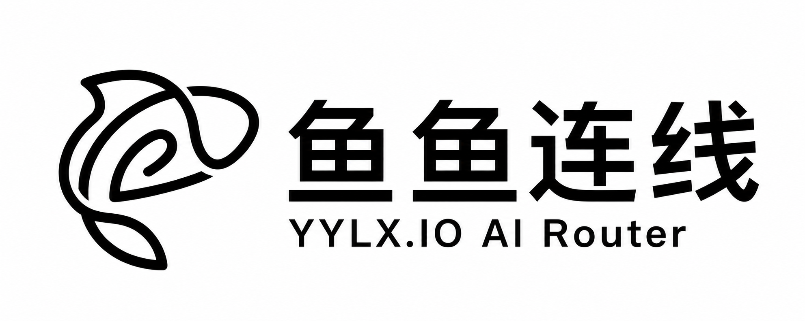

<p align="center">
  
</p>

<h1 align="center">CDXTheme</h1>

<p align="center">
  Codex と ChatGPT を自分らしい外観に変える、ネイティブデスクトップテーママネージャー。
</p>

<p align="center">
  <a href="https://cdxtheme.com"><strong>cdxtheme.com</strong></a>
</p>

<p align="center">
  <a href="README.md">English</a> ·
  <a href="README.zh-CN.md">简体中文</a> ·
  <strong>日本語</strong> ·
  <a href="README.ko.md">한국어</a>
</p>

<p align="center">
  <a href="https://github.com/croath/CDX-Theme/releases/latest"></a>
  <a href="https://github.com/croath/CDX-Theme/releases"></a>
  <a href="https://github.com/croath/CDX-Theme/actions/workflows/release.yml"></a>
  
  
  
  <a href="#ライセンス"></a>
</p>

> [!NOTE]
> CDXTheme は独立したコミュニティプロジェクトであり、OpenAI との提携や公式な承認を受けたものではありません。

## CDXTheme をスポンサーする

[スポンサーリストに掲載しませんか？](mailto:business@cdxtheme.com)

<table>
  <tbody>
    <tr>
      <td width="340" align="center">
        <br>
        <a href="https://yylx.io"><strong>YYLX AI Router</strong></a>
      </td>
      <td>YYLX は、Claude Code のワークフローに最適化された統合 AI モデル API ゲートウェイです。設定を1行変更するだけで、Claude と OpenAI GPT モデルを柔軟に切り替えられます。主要な AI モデルへ手軽かつ安定して接続できる環境を開発者に提供します。<a href="https://yylx.io">今すぐ登録すると、テスト用の $0.5 クレジットを無料で受け取れます。</a></td>
    </tr>
  </tbody>
</table>

## CDXTheme の使い方

### 1. ダウンロード

[公式サイト](https://cdxtheme.com)にアクセスするか、[GitHub Releases](https://github.com/croath/CDX-Theme/releases/latest) から最新のインストーラーを直接入手します。

| プラットフォーム | パッケージ | 状態 |
| --- | --- | --- |
| macOS 12+（Apple Silicon） | `.dmg` | 対応 |
| Windows x64 | NSIS `.exe` | 対応 |
| Linux | — | 現在は対象外 |

Codex / ChatGPT デスクトップアプリがインストールされている必要があります。CDXTheme は `127.0.0.1` 上の Chrome DevTools Protocol（CDP）を使ってローカル通信を行います。既定のポートは `9335` です。

### 2. テーマを選んで適用する

1. **おすすめ** を開き、利用可能なテーマとインストール済みテーマを確認します。
2. テーマを選択し、ワンクリックで適用します。
3. 必要に応じて、CDP ポートを有効にした Codex / ChatGPT の再起動を許可します。

CDXTheme は `~/.codex/config.toml` 内の対応する外観設定を更新し、ライブ CSS スキンをデスクトップレンダラーへ注入します。起動時に読み込まれる外観値が実際に変わった場合のみ Codex を再起動します。

### 3. 独自パッケージをインストールする

**インストール** を開き、対応するポータブル形式を読み込みます。

| 拡張子 | パッケージの `format` |
| --- | --- |
| `.cdxtheme` | `cdxtheme` |
| `.codedrobe-theme` | `codedrobe-theme` |

パッケージはスキーマバージョン `1`、最大 **30 MB** です。`@import` や `url(http…)` によるリモート CSS の読み込みは禁止されています。複数のアプリターゲットを含められますが、現在 CDXTheme が適用するのは `targets.codex` のみです。

### 4. 既定の外観へ戻す

**復元** を選ぶと、初回バックアップから管理対象の外観値を戻し、レンダラーへ注入されたテーマ要素を削除します。

### 主な機能

- 組み込み、オンライン、ローカルインストール済みテーマを閲覧。
- ポータブルテーマパッケージのインストールと削除。
- 外観設定とライブ CSS / ウィンドウスキンをまとめて適用。
- Codex / ChatGPT を以前の管理対象外観へ復元。
- CDXTheme のライト、ダーク、システム外観を切り替え。
- アプリ内で英語、簡体字中国語、繁体字中国語、日本語を選択。
- CDP ポートを設定し、必要に応じてホストアプリを再起動。

## テーマ作成 CLI

Rust CLI は共有ライブラリ `cdx-theme-core` の薄いコマンドラインインターフェースです。すべてのオプションは[完全な CLI ガイド](cli/README.md)を参照してください。

```bash
cargo install --path cli

# ソースディレクトリをポータブルパッケージへ変換
cdxtheme theme pack path/to/theme-source

# パッケージを展開または変換
cdxtheme theme unpack theme.cdxtheme path/to/output
cdxtheme theme convert theme.codedrobe-theme

# CDP 経由でパッケージを直接適用
cdxtheme apply --app codex --theme theme.cdxtheme
```

テーマのソースディレクトリには `theme.json`（推奨）または `manifest.json` と、CSS、任意の画像アセットを配置します。

## 技術概要

### 仕組み

```text
                         ~/.codex/config.toml
                    ┌──────────────────────────► 起動時の外観
                    │
┌──────────────┐    │    CDP on 127.0.0.1:9335
│   CDXTheme   │────┼──────────────────────────► ライブレンダラースキン
│  Tauri app   │    │
└──────────────┘    └──────────────────────────► バックアップ / 復元
```

1. **外観** — Codex 設定の `[desktop]` 配下にある対象キーを管理します。
2. **スキン** — CDP を介して、パッケージの CSS と埋め込み画像を `app://` レンダラーターゲットへ注入します。
3. **復元** — `config.before.toml` から管理対象キーを戻し、注入済み DOM を削除します。
4. **アップデート** — 署名済み Tauri アップデーターメタデータを確認し、利用可能なリリースをインストールします。

### 技術スタックと構成

| レイヤー | 技術 | 役割 |
| --- | --- | --- |
| デスクトップシェル | Tauri 2 | ネイティブウィンドウ、コマンド、更新、バンドル |
| フロントエンド | Rust · Leptos 0.8 · WASM | クライアント UI と状態管理 |
| スタイル | Tailwind CSS 4 | アプリケーション UI |
| ホスト連携 | Rust · CDP | 起動、注入、検証、復元 |
| ビルド | Cargo · Trunk · Bun | ワークスペース、WASM バンドル、依存関係 |

```text
├── src/          # Leptos CSR フロントエンド
├── app-tauri/    # Tauri バックエンドとデスクトップバンドル
├── core/         # パッケージ、起動、適用、注入の共有ロジック
├── cli/          # cdxtheme テーマ作成 CLI
├── types/        # 共有テーマ型
├── assets/       # レンダラー注入スクリプト
├── public/       # 静的アセット
├── style/        # Tailwind エントリーポイント
└── scripts/      # ビルドとオプションの補助スクリプト
```

### 開発

[Rust](https://rustup.rs/) `1.96.0`、`wasm32-unknown-unknown` ターゲット、[Trunk](https://trunkrs.dev/)、Tauri CLI 2、Bun または Node が必要です。macOS では Xcode Command Line Tools、Windows では WebView2 も必要です。

```bash
rustup target add wasm32-unknown-unknown
cargo install trunk
cargo install tauri-cli --version "^2"
bun install
cargo tauri dev
```

Trunk は `http://localhost:1420` でフロントエンドを配信します。デバッグビルドはターミナルとプラットフォームのアプリログへ記録し、Web Inspector を自動的に開きます。

確認用コマンド：

```bash
cargo check --manifest-path app-tauri/Cargo.toml
cargo check --target wasm32-unknown-unknown
cargo test --manifest-path app-tauri/Cargo.toml --lib
```

### ビルド

```bash
# macOS / Linux ホスト
./scripts/build.sh
./scripts/build.sh --debug
./scripts/build.sh --check

# Tauri を直接実行
cargo tauri build --manifest-path app-tauri/Cargo.toml
```

```powershell
# Windows PowerShell
.\scripts\build.ps1
.\scripts\build.ps1 -Debug
.\scripts\build.ps1 -Check
```

成果物は `target/release/bundle/` に生成されます。GitHub Release を公開すると、Apple Silicon macOS と Windows x64 向けのリリースワークフローが実行されます。

### 既定値とパス

| 項目 | 既定値 / パス |
| --- | --- |
| CDP エンドポイント | `127.0.0.1:9335` |
| Codex 設定 | `~/.codex/config.toml` |
| Windows の Codex 設定 | `%USERPROFILE%\.codex\config.toml` |
| 初回適用時のバックアップ | アプリデータディレクトリ → `config.before.toml` |
| ユーザーテーマ | アプリのローカルデータディレクトリ → `themes/` |

## トラブルシューティング

<details>
<summary><strong>Codex / ChatGPT が見つからない</strong></summary>

先にデスクトップアプリをインストールしてください。Windows では `OpenAI.Codex` という Microsoft Store パッケージも検出します。
</details>

<details>
<summary><strong>CDP が切断されている</strong></summary>

**設定** を開いてポートを確認し、保存して再起動してください。CDXTheme とホストアプリは同じ利用可能なポートを使う必要があります。
</details>

<details>
<summary><strong>外観またはスキンが更新されない</strong></summary>

起動時の外観値にはホストの再起動が必要で、ライブ CSS には CDP 接続が必要です。接続状態を確認してからテーマを再適用してください。
</details>

## ライセンス

特に記載がない限り、本プロジェクトは作者が提示するプロプライエタリな条件で提供されます。サードパーティ製コンポーネントには、それぞれのライセンスが適用されます。

---

<p align="center">
  <a href="https://cdxtheme.com">公式サイト</a> ·
  <a href="https://github.com/croath/CDX-Theme/releases/latest">ダウンロード</a> ·
  <a href="https://github.com/croath/CDX-Theme/issues">Issues</a> ·
  <a href="cli/README.md">CLI ドキュメント</a> ·
  <a href="mailto:business@cdxtheme.com">スポンサーのお問い合わせ</a>
</p>
