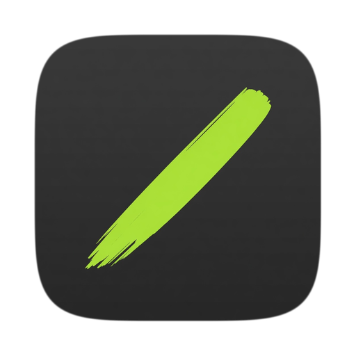

<p align="center">
  
</p>

<h1 align="center">CDXTheme</h1>

<p align="center">
  一款原生桌面主题管理器，让 Codex 与 ChatGPT 拥有属于你的外观。
</p>

<p align="center">
  <a href="README.md">English</a> ·
  <strong>简体中文</strong> ·
  <a href="README.ja.md">日本語</a> ·
  <a href="README.ko.md">한국어</a>
</p>

<p align="center">
  <a href="https://github.com/croath/CDX-Theme/releases/latest"></a>
  <a href="https://github.com/croath/CDX-Theme/releases"></a>
  <a href="https://github.com/croath/CDX-Theme/actions/workflows/release.yml"></a>
  
  
  
  <a href="#许可证"></a>
</p>

> **提示**
>
> CDXTheme 是独立的社区项目，与 OpenAI 不存在隶属关系，也未获得其官方背书。

## 赞助 CDXTheme

CDXTheme 由作者独立维护。赞助将帮助项目持续发布版本、测试不同平台、完善主题工具并进行长期维护。

现已开放赞助展示与合作。如需成为赞助商，请发送邮件至 [business@cdxtheme.com](mailto:business@cdxtheme.com)。

## 使用 CDXTheme

### 1. 下载

从 [GitHub Releases](https://github.com/croath/CDX-Theme/releases/latest) 获取最新安装包。

| 平台 | 安装包 | 状态 |
| --- | --- | --- |
| macOS 12+（Apple Silicon） | `.dmg` | 支持 |
| Windows x64 | NSIS `.exe` | 支持 |
| Linux | — | 暂未适配 |

使用前需安装 Codex / ChatGPT 桌面应用。CDXTheme 通过 `127.0.0.1` 上的 Chrome DevTools Protocol（CDP）与应用进行本地通信，默认端口为 `9335`。

### 2. 选择并应用主题

1. 打开 **推荐**，浏览在线和已安装的主题。
2. 选择主题，一键应用。
3. 如果出现提示，请允许 CDXTheme 重新启动 Codex / ChatGPT 并启用 CDP 端口。

CDXTheme 会更新 `~/.codex/config.toml` 中受支持的外观配置，并将实时 CSS 皮肤注入桌面渲染器。只有启动时加载的外观值确实发生变化，Codex 才会重启。

### 3. 安装自己的主题包

打开 **安装**，导入任一受支持的便携格式：

| 扩展名 | 包内 `format` |
| --- | --- |
| `.cdxtheme` | `cdxtheme` |
| `.codedrobe-theme` | `codedrobe-theme` |

主题包使用版本为 `1` 的 schema，最大 **30 MB**，且不能通过 `@import` 或 `url(http…)` 加载远程 CSS。一个包可以描述多个应用目标，但 CDXTheme 目前只应用 `targets.codex`。

### 4. 恢复默认外观

选择 **恢复**，即可从首次备份中还原受管理的外观值，并移除渲染器中注入的主题元素。

### 主要功能

- 浏览内置、在线和本地安装的主题。
- 安装和删除便携主题包。
- 同时应用外观配置与实时 CSS / 窗口皮肤。
- 将 Codex / ChatGPT 恢复到此前受管理的外观。
- 在浅色、深色和跟随系统之间切换 CDXTheme 界面。
- 应用内支持英文、简体中文、繁体中文和日文。
- 配置 CDP 端口，并在需要时重新启动宿主应用。

## 主题制作 CLI

Rust CLI 是共享库 `cdx-theme-core` 的轻量命令行入口。全部选项请查看[完整 CLI 指南](cli/README.md)。

```bash
cargo install --path cli

# 将主题源码目录打包为便携主题包
cdxtheme theme pack path/to/theme-source

# 解包或转换主题包
cdxtheme theme unpack theme.cdxtheme path/to/output
cdxtheme theme convert theme.codedrobe-theme

# 直接通过 CDP 应用主题包
cdxtheme apply --app codex --theme theme.cdxtheme
```

主题源码目录使用 `theme.json`（推荐）或 `manifest.json`，并包含 CSS 和可选图片资源。

## 技术概览

### 工作原理

```text
                         ~/.codex/config.toml
                    ┌──────────────────────────► 启动时外观
                    │
┌──────────────┐    │    CDP on 127.0.0.1:9335
│   CDXTheme   │────┼──────────────────────────► 实时渲染器皮肤
│  Tauri 应用  │    │
└──────────────┘    └──────────────────────────► 备份 / 恢复
```

1. **外观** — 管理 Codex 配置中 `[desktop]` 下的指定键值。
2. **皮肤** — 通过 CDP 将主题包 CSS 和内嵌图片注入 `app://` 渲染目标。
3. **恢复** — 从 `config.before.toml` 还原受管理键值，并移除注入的 DOM。
4. **更新** — 检查带签名的 Tauri 更新元数据，并安装可用版本。

### 技术栈与架构

| 层级 | 技术 | 职责 |
| --- | --- | --- |
| 桌面外壳 | Tauri 2 | 原生窗口、命令、更新与打包 |
| 前端 | Rust · Leptos 0.8 · WASM | 客户端界面与状态 |
| 样式 | Tailwind CSS 4 | 应用界面样式 |
| 宿主集成 | Rust · CDP | 启动、注入、验证与恢复 |
| 构建 | Cargo · Trunk · Bun | 工作区、WASM 打包与前端依赖 |

```text
├── src/          # Leptos CSR 前端
├── app-tauri/    # Tauri 后端与桌面包
├── core/         # 共享的包、启动、应用和注入逻辑
├── cli/          # cdxtheme 主题制作 CLI
├── types/        # 共享主题类型
├── assets/       # 渲染器注入脚本
├── public/       # 静态资源
├── style/        # Tailwind 入口
└── scripts/      # 构建与可选辅助脚本
```

### 开发

需要 [Rust](https://rustup.rs/) `1.96.0`、`wasm32-unknown-unknown` target、[Trunk](https://trunkrs.dev/)、Tauri CLI 2，以及 Bun 或 Node。macOS 开发还需要 Xcode Command Line Tools；Windows 需要 WebView2。

```bash
rustup target add wasm32-unknown-unknown
cargo install trunk
cargo install tauri-cli --version "^2"
bun install
cargo tauri dev
```

Trunk 在 `http://localhost:1420` 提供前端服务。Debug 构建会将日志写入终端和平台应用日志目录，并自动打开 Web Inspector。

常用检查：

```bash
cargo check --manifest-path app-tauri/Cargo.toml
cargo check --target wasm32-unknown-unknown
cargo test --manifest-path app-tauri/Cargo.toml --lib
```

### 构建

```bash
# macOS / Linux 主机
./scripts/build.sh
./scripts/build.sh --debug
./scripts/build.sh --check

# 直接使用 Tauri 构建
cargo tauri build --manifest-path app-tauri/Cargo.toml
```

```powershell
# Windows PowerShell
.\scripts\build.ps1
.\scripts\build.ps1 -Debug
.\scripts\build.ps1 -Check
```

构建产物位于 `target/release/bundle/`。发布 GitHub Release 后，工作流会自动构建 Apple Silicon macOS 和 Windows x64 产物。

### 默认值与路径

| 项目 | 默认值 / 路径 |
| --- | --- |
| CDP 地址 | `127.0.0.1:9335` |
| Codex 配置 | `~/.codex/config.toml` |
| Windows Codex 配置 | `%USERPROFILE%\.codex\config.toml` |
| 首次应用备份 | 应用数据目录 → `config.before.toml` |
| 用户主题 | 应用本地数据目录 → `themes/` |

## 故障排查

<details>
<summary><strong>找不到 Codex / ChatGPT</strong></summary>

请先安装桌面应用。在 Windows 上，CDXTheme 也会检测名为 `OpenAI.Codex` 的 Microsoft Store 软件包。
</details>

<details>
<summary><strong>CDP 未连接</strong></summary>

打开 **设置**，确认端口后保存并重新启动。CDXTheme 与宿主应用必须使用同一个可用端口。
</details>

<details>
<summary><strong>外观或皮肤没有更新</strong></summary>

启动时外观值需要重启宿主应用；实时 CSS 需要正常的 CDP 连接。确认连接状态后重新应用主题。
</details>

## 许可证

除非另有说明，本项目由作者按专有方式提供。第三方组件仍分别受其自身许可证约束。

---

<p align="center">
  <a href="https://github.com/croath/CDX-Theme/releases/latest">下载</a> ·
  <a href="https://github.com/croath/CDX-Theme/issues">反馈问题</a> ·
  <a href="cli/README.md">CLI 文档</a> ·
  <a href="mailto:business@cdxtheme.com">赞助咨询</a>
</p>
