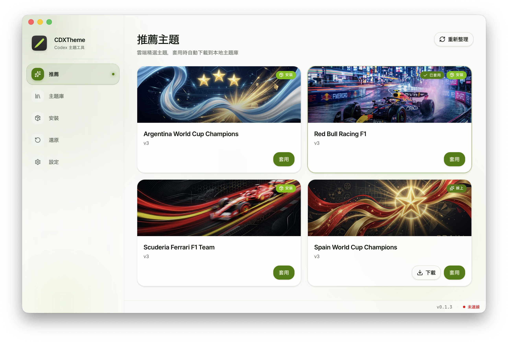
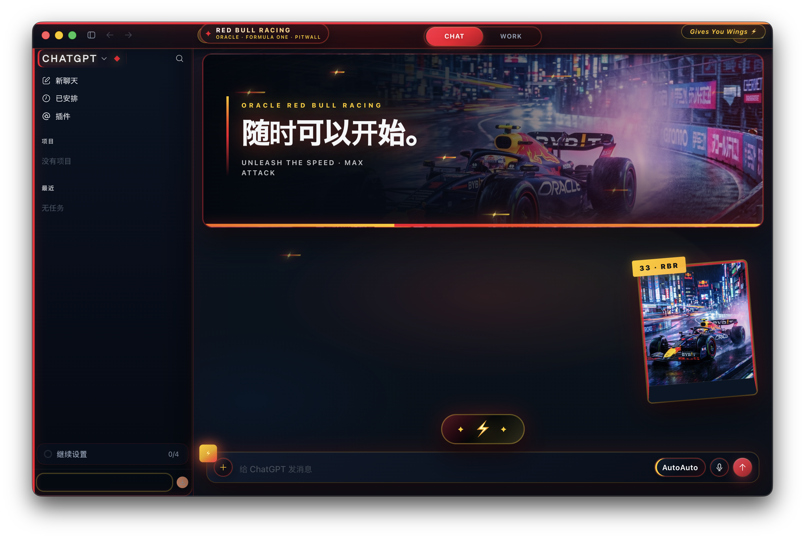

<p align="center">
  
</p>

<h1 align="center">CDXTheme</h1>

<p align="center">
  一款原生桌面主題管理器，讓 Codex 與 ChatGPT 擁有屬於你的外觀。
</p>

<p align="center">
  <a href="https://cdxtheme.com"><strong>cdxtheme.com</strong></a>
</p>

<p align="center">
  <a href="README.md">English</a> ·
  <a href="README.zh-Hans.md">简体中文</a> ·
  <strong>繁體中文</strong> ·
  <a href="README.ja.md">日本語</a> ·
  <a href="README.ko.md">한국어</a>
</p>

<p align="center">
  <a href="https://github.com/croath/CDX-Theme/releases/latest"></a>
  <a href="https://github.com/croath/CDX-Theme/releases"></a>
  <a href="https://github.com/croath/CDX-Theme/actions/workflows/release.yml"></a>
  
  
  
  <a href="#授權條款"></a>
</p>

> **提示**
>
> CDXTheme 是獨立的社群專案，與 OpenAI 不存在隸屬關係，也未獲得其官方背書。

## 贊助 CDXTheme

[想出現在贊助列表？](mailto:business@cdxtheme.com)

<table>
  <tbody>
    <tr>
      <td width="340" align="center">
        <br>
        <a href="https://yylx.io"><strong>魚魚連線中轉站</strong></a>
      </td>
      <td>魚魚連線中轉站提供統一的 AI 模型 API 閘道服務，專為 Claude Code 使用場景最佳化。只需替換一行設定，即可在 Claude 與 OpenAI GPT 模型之間靈活切換，為開發者提供便捷、穩定的主流 AI 模型接入體驗。<a href="https://yylx.io">點擊註冊免費領取 $0.5 測試金額</a>。</td>
    </tr>
  </tbody>
</table>

## 截圖

### CDXTheme 應用

<p align="center">
  
</p>

### 套用主題後的 ChatGPT

<p align="center">
  
  
</p>

## 使用 CDXTheme

### 1. 下載

造訪 [CDXTheme 官網](https://cdxtheme.com)，或直接從 [GitHub Releases](https://github.com/croath/CDX-Theme/releases/latest) 取得最新安裝包。

| 平台 | 安裝包 | 狀態 |
| --- | --- | --- |
| macOS 12+（Apple Silicon） | `.dmg` | 支援 |
| Windows x64 | NSIS `.exe` | 支援 |
| Linux | — | 暫未適配 |

使用前需安裝 Codex / ChatGPT 桌面應用。CDXTheme 透過 `127.0.0.1` 上的 Chrome DevTools Protocol（CDP）與應用進行本機通訊，預設連接埠為 `9335`。

### 2. 選擇並套用主題

1. 開啟 **推薦**，瀏覽線上和已安裝的主題。
2. 選擇主題，一鍵套用。
3. 如果出現提示，請允許 CDXTheme 重新啟動 Codex / ChatGPT 並啟用 CDP 連接埠。

CDXTheme 會更新 `~/.codex/config.toml` 中受支援的外觀設定，並將即時 CSS 皮膚注入桌面渲染器。只有啟動時載入的外觀值確實發生變化，Codex 才會重啟。

### 3. 安裝自己的主題包

開啟 **安裝**，匯入任一受支援的可攜格式：

| 副檔名 | 包內 `format` |
| --- | --- |
| `.cdxtheme` | `cdxtheme` |

主題包使用版本為 `1` 的 schema，最大 **30 MB**，且不能透過 `@import` 或 `url(http…)` 載入遠端 CSS。一個包可以描述多個應用目標，但 CDXTheme 目前只套用 `targets.codex`。

### 4. 還原預設外觀

選擇 **還原**，即可從首次備份中還原受管理的外觀值，並移除渲染器中注入的主題元素。

### 主要功能

- 瀏覽內建、線上和本機安裝的主題。
- 安裝和刪除可攜主題包。
- 同時套用外觀設定與即時 CSS / 視窗皮膚。
- 將 Codex / ChatGPT 還原到此前受管理的外觀。
- 在淺色、深色和跟隨系統之間切換 CDXTheme 介面。
- 應用內支援英文、簡體中文、繁體中文和日文。
- 設定 CDP 連接埠，並在需要時重新啟動宿主應用。

## 主題製作 CLI

Rust CLI 是共享庫 `cdx-theme-core` 的輕量命令列入口。全部選項請查看[完整 CLI 指南](cli/README.md)。

```bash
cargo install --path cli

# 將主題原始碼目錄打包為可攜主題包
cdxtheme theme pack path/to/theme-source

# 解包或轉換主題包
cdxtheme theme unpack theme.cdxtheme path/to/output

# 直接透過 CDP 套用主題包
cdxtheme apply --app codex --theme theme.cdxtheme
```

主題原始碼目錄使用 `theme.json`（推薦）或 `manifest.json`，並包含 CSS 和可選圖片資源。

## 技術概覽

### 工作原理

```text
                         ~/.codex/config.toml
                    ┌──────────────────────────► 啟動時外觀
                    │
┌──────────────┐    │    CDP on 127.0.0.1:9335
│   CDXTheme   │────┼──────────────────────────► 即時渲染器皮膚
│  Tauri 應用  │    │
└──────────────┘    └──────────────────────────► 備份 / 還原
```

1. **外觀** — 管理 Codex 設定中 `[desktop]` 下的指定鍵值。
2. **皮膚** — 透過 CDP 將主題包 CSS 和內嵌圖片注入 `app://` 渲染目標。
3. **還原** — 從 `config.before.toml` 還原受管理鍵值，並移除注入的 DOM。
4. **更新** — 檢查帶簽章的 Tauri 更新中繼資料，並安裝可用版本。

### 技術堆疊與架構

| 層級 | 技術 | 職責 |
| --- | --- | --- |
| 桌面外殼 | Tauri 2 | 原生視窗、命令、更新與打包 |
| 前端 | Rust · Leptos 0.8 · WASM | 用戶端介面與狀態 |
| 樣式 | Tailwind CSS 4 | 應用介面樣式 |
| 宿主整合 | Rust · CDP | 啟動、注入、驗證與還原 |
| 建置 | Cargo · Trunk · Bun | 工作區、WASM 打包與前端依賴 |

```text
├── src/          # Leptos CSR 前端
├── app-tauri/    # Tauri 後端與桌面包
├── core/         # 共享的包、啟動、套用和注入邏輯
├── cli/          # cdxtheme 主題製作 CLI
├── types/        # 共享主題型別
├── assets/       # 渲染器注入腳本
├── public/       # 靜態資源
├── style/        # Tailwind 入口
└── scripts/      # 建置與可選輔助腳本
```

### 開發

需要 [Rust](https://rustup.rs/) `1.96.0`、`wasm32-unknown-unknown` target、[Trunk](https://trunkrs.dev/)、Tauri CLI 2，以及 Bun 或 Node。macOS 開發還需要 Xcode Command Line Tools；Windows 需要 WebView2。

```bash
rustup target add wasm32-unknown-unknown
cargo install trunk
cargo install tauri-cli --version "^2"
bun install
cargo tauri dev
```

Trunk 在 `http://localhost:1420` 提供前端服務。Debug 建置會將日誌寫入終端機和平台應用日誌目錄，並自動開啟 Web Inspector。

常用檢查：

```bash
cargo check --manifest-path app-tauri/Cargo.toml
cargo check --target wasm32-unknown-unknown
cargo test --manifest-path app-tauri/Cargo.toml --lib
```

### 建置

```bash
# macOS / Linux 主機
./scripts/build.sh
./scripts/build.sh --debug
./scripts/build.sh --check

# 直接使用 Tauri 建置
cargo tauri build --manifest-path app-tauri/Cargo.toml
```

```powershell
# Windows PowerShell
.\scripts\build.ps1
.\scripts\build.ps1 -Debug
.\scripts\build.ps1 -Check
```

建置產物位於 `target/release/bundle/`。發布 GitHub Release 後，工作流程會自動建置 Apple Silicon macOS 和 Windows x64 產物。

### 預設值與路徑

| 項目 | 預設值 / 路徑 |
| --- | --- |
| CDP 位址 | `127.0.0.1:9335` |
| Codex 設定 | `~/.codex/config.toml` |
| Windows Codex 設定 | `%USERPROFILE%\.codex\config.toml` |
| 首次套用備份 | 應用資料目錄 → `config.before.toml` |
| 使用者主題 | 應用本機資料目錄 → `themes/` |

## 疑難排解

<details>
<summary><strong>找不到 Codex / ChatGPT</strong></summary>

請先安裝桌面應用。在 Windows 上，CDXTheme 也會偵測名為 `OpenAI.Codex` 的 Microsoft Store 套件。
</details>

<details>
<summary><strong>CDP 未連線</strong></summary>

開啟 **設定**，確認連接埠後儲存並重新啟動。CDXTheme 與宿主應用必須使用同一個可用連接埠。
</details>

<details>
<summary><strong>外觀或皮膚沒有更新</strong></summary>

啟動時外觀值需要重啟宿主應用；即時 CSS 需要正常的 CDP 連線。確認連線狀態後重新套用主題。
</details>

## 授權條款

除非另有說明，本專案由作者按專有方式提供。第三方元件仍分別受其自身授權條款約束。

---

<p align="center">
  <a href="https://cdxtheme.com">官網</a> ·
  <a href="https://github.com/croath/CDX-Theme/releases/latest">下載</a> ·
  <a href="https://github.com/croath/CDX-Theme/issues">回饋問題</a> ·
  <a href="cli/README.md">CLI 文件</a> ·
  <a href="mailto:business@cdxtheme.com">贊助諮詢</a>
</p>
